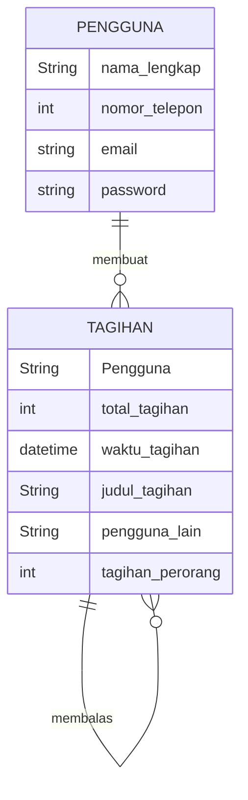
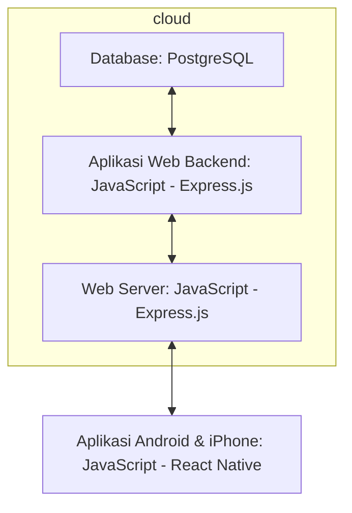

## 1.1 Latar Belakang

Latar belakang pembuatan aplikasi ini berkaitan dengan masalah umum dan hal kecil yang sering dihadapi oleh banyak orang, yaitu pembagian tagihan yang adil dan mudah 

Dengan adanya aplikasi sharebills, pengguna dapat membagi pengeluaran dengan mudah dan menghindari kesalahpahaman atau konflik terkait pembagian pengeluaran. Aplikasi ini sangat berguna saat bepergian bersama teman atau keluarga dan dapat membantu menghemat waktu dan usaha dalam menghitung pembagian pengeluaran. Cukup gunakan aplikasi ini tanpa ribet dan mudah untuk digunakan

## 1.2. Deksripsi Teknologi Informasi

Aplikasi "sharebills" adalah sebuah alat atau aplikasi yang dibuat untuk memudahkan pengguna dalam membagi biaya atau tagihan dengan teman atau keluarga secara adil dan tanpa ribet. UI/UX aplikasi ini dibuat dengan bantuan Figma dan beberapa referensi yang saya ambil di web dribbble, rencananya aplikasi akan dibuat dengan bantuan react native, untuk database rencana akan memakai postgresql

## 1.3. Branding

Pada tahap ini kita mengeksplorasi branding dari sistem yang dibuat. Branding meliputi:
- Merk: sharebills
- Tagline: membagi tagihan, bukan persahabatan
- Campaign: aplikasi yang membuat penggunanya mudah membagi tagihan mereka, dengan cepat dan adil 

Target user:
- Usia 18+ (usia dibawah itu perlu pendampingan)
- Seorang yang ingin membagi tagihan dengan adil dan cepat
- Seorang yang tidak ingin ribet
  
User experience theme:
- Mudah
- Sederhana
- Warna: dominan white and black 

Inspirasi desain:

## 2. User Story

Sebagai | Saya ingin bisa | Sehingga | Prioritas
---|---|---|---
|Pengguna|Membuat pembagian tagihan|Bisa membagi tagihan|⭐⭐⭐⭐⭐
|Pengguna|Menerima pembayaran tagihan dari pengguna lain|Bisa menerima uang|⭐⭐⭐⭐⭐
|Pengguna|Mengirim pembayaran tagihan ke pengguna lain|Bisa mengirim uang|⭐⭐⭐⭐⭐
|Pengguna|Melihat pengguna lain|Memudahkan pengguna mencari tau siapa saja yang ikut berpartisipasi|⭐⭐⭐⭐
|Pengguna|Melihat waktu pembayaran|Membantu mengetahui tenggat pembayaran|⭐⭐⭐⭐⭐
|Pengguna|Menyimpan kontak user lain|Memudahkan menambahkan user lain ke list tagihan|⭐⭐⭐
|Pengguna|Mengirim notif tagihan|Memudahkan mengingat pembayaran|⭐⭐
|Pengguna|Melihat riwayat pembayaran|Memudahkan melacak pembayaran|⭐⭐
|Pengguna|Chatingan dengan user lain|Memudahkan komunikasi|⭐

## 3. Struktur Data

- Pada tahap ini, kita sedang mengeksplorasi dan menganalisis struktur data yang dapat mendukung user story yang ada, serta yang mungkin dibutuhkan di masa depan.
- Kita akan merepresentasikan entitas dalam aplikasi dalam bentuk tabel entitas dan atribut

## 4. Arsitektur Sistem

Pada tahap ini kita merancang arsitektur berikut teknologi yang terdapat pada setiap komponen pembentuk aplikasi.

## 5. Teknologi, Library, dan Framework

1. Bahasa Pemrograman:
- Java dan javascript

2. Platform Mobile:
- Android Studio

3. Framework Aplikasi:
- React Native

4. Database:
- PostgreSQL

5. UI/UX Design:
- Figma

## 6. Desain User Experience dan User Interface

Ini adalah UX design yang saya buat dengan menggunakan figma, jika ingin melihat langsung bisa di link berikut:
[figma](https://www.figma.com/file/Qu18CDqYvsBRFQdtxI0rWv/split-bill?type=design&node-id=0%3A1&mode=design&t=VXjV1kk0fPMUqq9J-1)

## 7. Demonstrasi Video

Link youtube: https://youtu.be/dg1vWfWrvtE

## 8. Bagaimana mesin komputasi dan sistem operasi berperan dalam produk teknologi informasimu ?

Link youtube: https://youtu.be/dg1vWfWrvtE?t=235

## 9. Bagaimana algoritma, struktur data, dan bahasa pemrograman berperan dalam produk teknologi informasimu ?

Link youtube: https://youtu.be/dg1vWfWrvtE?t=336

## 10. Bagaimana metode pengembangan perangkat lunak / Software Development Life Cycle berperan dalam produk teknologi informasimu ?

Link youtube: https://youtu.be/dg1vWfWrvtE?t=546

## 11. Bagaimana database / sistem basis data berperan dalam produk teknologi informasimu ?

Link youtube: https://youtu.be/dg1vWfWrvtE?t=710

